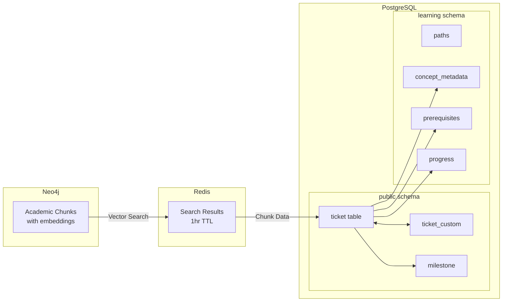
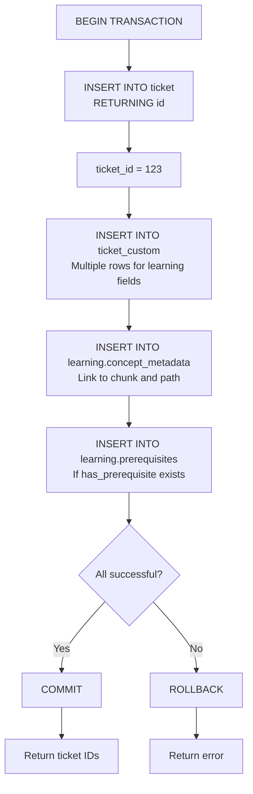
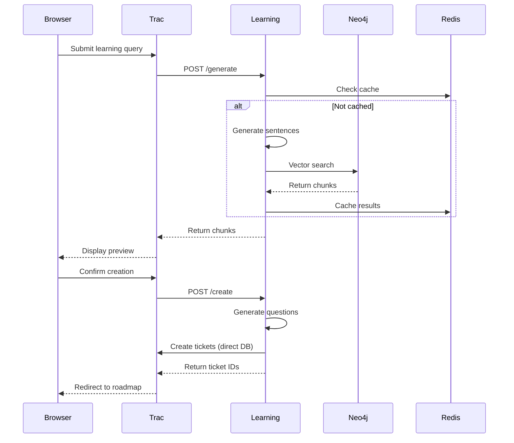
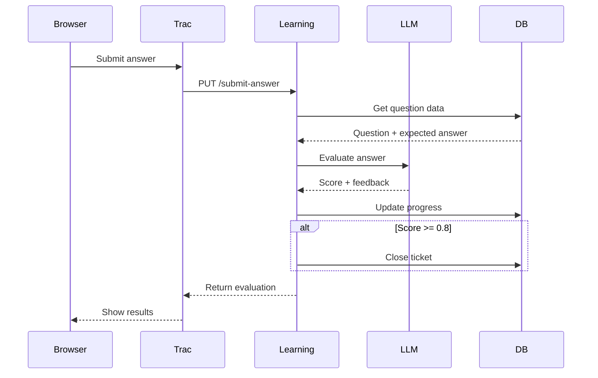
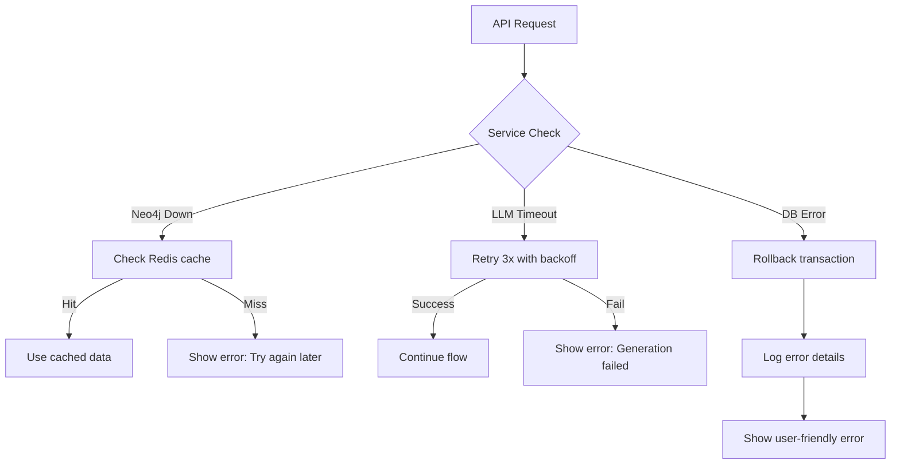
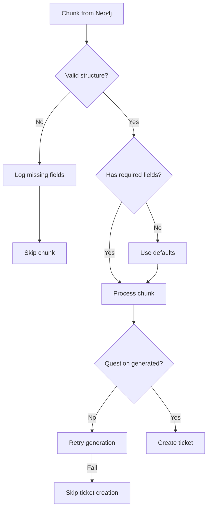
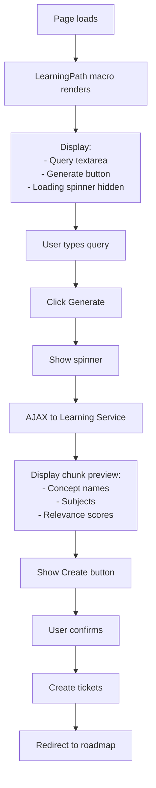
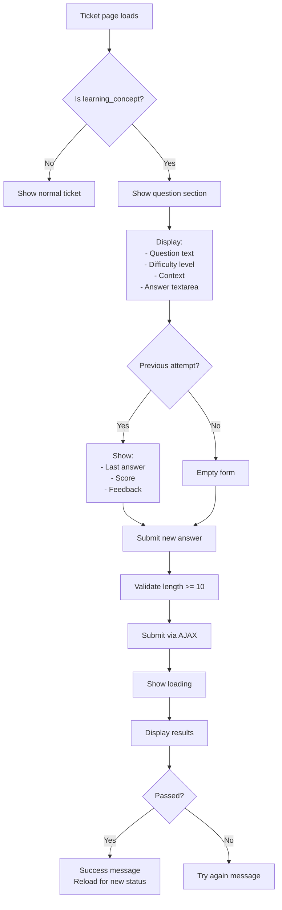

# Data Flow Diagram - Question-Based Learning MVP for Trac 1.4.4

## 1. Overview

This document illustrates the data flows for the question-based learning system using Neo4j vector search for content discovery and LLM evaluation for progress tracking.

## 2. High-Level MVP Data Flow

```mermaid
graph LR
    UI[User Query] --> WM[Wiki Macro]
    WM --> LS[Learning Service]
    LS --> LLM1[LLM: Generate Sentences]
    LLM1 --> NEO[Neo4j: Vector Search]
    NEO --> CACHE[Redis: Cache Results]
    CACHE --> PREVIEW[Show Chunks]
    PREVIEW --> CREATE[Create Tickets]
    CREATE --> QUESTIONS[Generate Questions]
    QUESTIONS --> DB[PostgreSQL]
    DB --> DISPLAY[Show Questions]
    DISPLAY --> ANSWER[Student Answers]
    ANSWER --> LLM2[LLM: Evaluate]
    LLM2 --> PROGRESS[Update Progress]
    PROGRESS --> GRAPH[Update Graph]
```



## 3. Core Feature Data Flows

### 3.1 Learning Path Generation Flow

```mermaid
flowchart TD
    A[User enters query in Wiki page] --> B[LearningPath macro triggered]
    
    B --> C[JavaScript sends to Learning Service]
    C --> D[POST /api/v1/learning-paths/generate<br/>{query: 'I want to learn machine learning',<br/>user_id: 'john.doe'}]
    
    D --> E[Check Redis cache]
    E --> F{Cached?}
    F -->|Yes| G[Return cached chunks]
    F -->|No| H[Generate 5 academic sentences via LLM]
    
    H --> I[Example sentences:<br/>1. Machine learning uses statistical models<br/>2. Supervised learning requires labeled data<br/>3. Neural networks process information in layers<br/>4. Training involves optimizing parameters<br/>5. Validation prevents overfitting]
    
    I --> J[Create embeddings for each sentence]
    J --> K[Average embeddings into single vector]
    
    K --> L[Neo4j vector search]
    L --> M[MATCH (c:Chunk)<br/>WITH c, gds.similarity.cosine(c.embedding, $vector) AS score<br/>WHERE score >= 0.65<br/>RETURN c LIMIT 20]
    
    M --> N[Return chunks with metadata:<br/>- id, content, subject, concept<br/>- has_prerequisite, prerequisite_for<br/>- relevance_score]
    
    N --> O[Cache in Redis with 1hr TTL]
    O --> P[Return to Trac for display]
    
    P --> Q[Display chunk preview:<br/>✓ 20 concepts found<br/>✓ Grouped by subject<br/>✓ Show relevance scores]
```

### 3.2 Ticket Creation with Questions Flow

```mermaid
flowchart TD
    A[User clicks Create Learning Path] --> B[POST /api/v1/learning-paths/create]
    
    B --> C[Retrieve chunks from Redis cache]
    C --> D[For each chunk]
    
    D --> E[Generate question via LLM]
    E --> F[Prompt: Create a question that tests understanding of:<br/>Concept: {chunk.concept}<br/>Content: {chunk.content}<br/>Difficulty: {1-5}<br/>Context: {original_query}]
    
    F --> G[LLM returns:<br/>- Question text<br/>- Expected answer]
    
    G --> H[Create ticket in PostgreSQL]
    H --> I[INSERT INTO ticket:<br/>type='learning_concept'<br/>summary=chunk.concept<br/>description=chunk.content<br/>milestone=chunk.subject<br/>status='new']
    
    I --> J[Store learning fields in ticket_custom:<br/>- question<br/>- question_difficulty<br/>- question_context<br/>- expected_answer<br/>- has_prerequisite<br/>- prerequisite_for]
    
    J --> K[Create learning.concept_metadata:<br/>ticket_id, path_id, chunk_id,<br/>relevance_score, question_generated]
    
    K --> L[Create prerequisites if has_prerequisite exists]
    L --> M[INSERT INTO learning.prerequisites<br/>(concept_ticket_id, prerequisite_ticket_id)]
    
    M --> N[Return created ticket IDs]
    N --> O[Redirect to roadmap view]
```

### 3.3 Question Display and Answer Flow

```mermaid
flowchart TD
    A[User opens learning ticket] --> B[Trac loads ticket data]
    
    B --> C[Check ticket type = 'learning_concept']
    C --> D[Load custom fields from ticket_custom]
    
    D --> E[Display question prominently:<br/>Question: {question}<br/>Difficulty: {difficulty}/5<br/>Context: {question_context}]
    
    E --> F[Check user progress]
    F --> G[SELECT * FROM learning.progress<br/>WHERE user_id = $1 AND ticket_id = $2]
    
    G --> H{Previous attempt?}
    H -->|Yes| I[Show previous answer:<br/>Your answer: {last_answer}<br/>Score: {answer_score}%<br/>Feedback: {answer_feedback}]
    H -->|No| J[Show empty answer textarea]
    
    I --> K[Answer submission area]
    J --> K
    
    K --> L[Student types answer]
    L --> M[Click Submit Answer]
    
    M --> N[AJAX PUT /api/v1/progress/{ticket_id}/submit-answer<br/>{answer: 'Student response text'}]
```

### 3.4 Answer Evaluation Flow

```mermaid
flowchart TD
    A[Learning Service receives answer] --> B[Load question data from DB]
    
    B --> C[SELECT question, expected_answer,<br/>question_context, question_difficulty<br/>FROM ticket_custom WHERE ticket = $1]
    
    C --> D[Send to LLM for evaluation]
    D --> E[Prompt: Evaluate this answer:<br/>Question: {question}<br/>Student Answer: {student_answer}<br/>Expected Answer: {expected_answer}<br/>Context: {question_context}<br/>Return score 0-1 and feedback]
    
    E --> F[LLM returns:<br/>score: 0.85<br/>feedback: 'Good understanding...<br/>Consider also mentioning...']
    
    F --> G{Score >= 0.8?}
    G -->|Yes| H[Status = 'mastered']
    G -->|No| I[Status = 'studying']
    
    H --> J[Update ticket: status='closed', resolution='fixed']
    I --> K[Keep ticket status='assigned']
    
    J --> L[Update learning.progress]
    K --> L
    
    L --> M[INSERT/UPDATE learning.progress:<br/>status, last_answer, answer_score,<br/>answer_feedback, last_accessed]
    
    M --> N[Return evaluation to user]
    N --> O[Display score and feedback]
    
    O --> P{Passed?}
    P -->|Yes| Q[Show success message<br/>Enable next concept]
    P -->|No| R[Show try again option]
```

### 3.5 Knowledge Graph Generation Flow

```mermaid
flowchart TD
    A[Wiki page with KnowledgeGraph macro] --> B[Parse parameters:<br/>milestone='Machine Learning']
    
    B --> C[Generate cache key:<br/>MD5(milestone + user_id)]
    
    C --> D{Graph cached?}
    D -->|Yes| E[Return cached PNG]
    D -->|No| F[Query database for concepts]
    
    F --> G[SELECT t.id, t.summary, t.status,<br/>p.status as learning_status<br/>FROM ticket t<br/>LEFT JOIN learning.progress p<br/>WHERE t.milestone = $1<br/>AND t.type = 'learning_concept']
    
    G --> H[Query prerequisites]
    H --> I[SELECT * FROM learning.prerequisites<br/>WHERE concept_ticket_id IN (...)]
    
    I --> J[Build GraphViz DOT structure]
    J --> K[Create nodes with colors:<br/>Gray: not_started<br/>Orange: studying<br/>Green: mastered (score >= 0.8)]
    
    K --> L[Add prerequisite edges]
    L --> M[Group by milestone subgraphs]
    
    M --> N[GraphViz render:<br/>- PNG image<br/>- HTML image map]
    
    N --> O[Save to cache directory]
    O --> P[Return HTML:<br/>img src='/graphs/{hash}.png'<br/>map with clickable areas]
```

### 3.6 Progress Tracking Data Flow

```mermaid
flowchart TD
    A[Answer evaluation completes] --> B{Score >= 0.8?}
    
    B -->|Yes| C[Update ticket status to 'closed']
    B -->|No| D[Keep ticket status 'assigned']
    
    C --> E[Update progress: status='mastered']
    D --> F[Update progress: status='studying']
    
    E --> G[Check milestone completion]
    F --> G
    
    G --> H[SELECT COUNT(*) total,<br/>COUNT(CASE WHEN p.status='mastered') mastered<br/>FROM ticket t<br/>JOIN learning.progress p<br/>WHERE t.milestone = $1]
    
    H --> I[Calculate completion percentage]
    I --> J[Update roadmap view]
    
    J --> K[Regenerate knowledge graph]
    K --> L[Clear graph cache for user]
    
    L --> M[Next graph request shows updated colors]
```

## 4. Database Operations Flow

### 4.1 Cross-System Data Flow



### 4.2 Ticket Creation Transaction



## 5. API Communication Patterns

### 5.1 Trac to Learning Service Flow



### 5.2 Answer Evaluation Flow



## 6. Caching Strategy Flow

### 6.1 Redis Cache Usage

```mermaid
flowchart TD
    A[Learning Query] --> B[Generate cache key:<br/>path:{query}:{user_id}]
    
    B --> C{Check Redis}
    C -->|Hit| D[Return cached chunks<br/>< 50ms]
    C -->|Miss| E[Neo4j vector search<br/>~2 seconds]
    
    E --> F[Store in Redis<br/>TTL: 3600 seconds]
    F --> G[Return chunks]
    
    H[Cache expires after 1 hour] --> I[Next query searches Neo4j again]
```

### 6.2 Graph Cache Management

```mermaid
flowchart TD
    A[Graph request] --> B[Cache key: MD5(milestone+user)]
    
    B --> C{PNG exists?}
    C -->|Yes| D[Check if stale]
    C -->|No| E[Generate new graph]
    
    D --> F{Progress updated?}
    F -->|Yes| G[Delete cached file]
    F -->|No| H[Serve cached PNG]
    
    G --> E
    E --> I[GraphViz render]
    I --> J[Save PNG + map]
    J --> K[Serve new graph]
```

## 7. Error Handling Flows

### 7.1 Service Failure Handling



### 7.2 Data Validation Flow



## 8. User Interface Data Flows

### 8.1 Wiki Macro Interaction



### 8.2 Answer Submission UI Flow



## 9. Performance Optimization Flows

### 9.1 Batch Operations

```mermaid
flowchart TD
    A[20 chunks to process] --> B[Group by milestone]
    
    B --> C[Prepare batch inserts]
    C --> D[Single transaction]
    
    D --> E[INSERT INTO ticket<br/>VALUES (...) x 20<br/>RETURNING id]
    
    E --> F[Map IDs to chunks]
    F --> G[Batch insert custom fields]
    
    G --> H[INSERT INTO ticket_custom<br/>VALUES (...) x 120<br/>(6 fields × 20 tickets)]
    
    H --> I[Create prerequisites]
    I --> J[COMMIT]
    
    J --> K[Total time: ~5 seconds]
```

### 9.2 Query Optimization

```mermaid
flowchart TD
    A[Complex progress query] --> B[Use indexed columns]
    
    B --> C[Indexes:<br/>- progress(user_id)<br/>- progress(status)<br/>- ticket(type)<br/>- ticket(milestone)]
    
    C --> D[Query plan:<br/>1. Filter by user_id<br/>2. Join on indexed ticket_id<br/>3. Filter by type<br/>4. Group by milestone]
    
    D -->