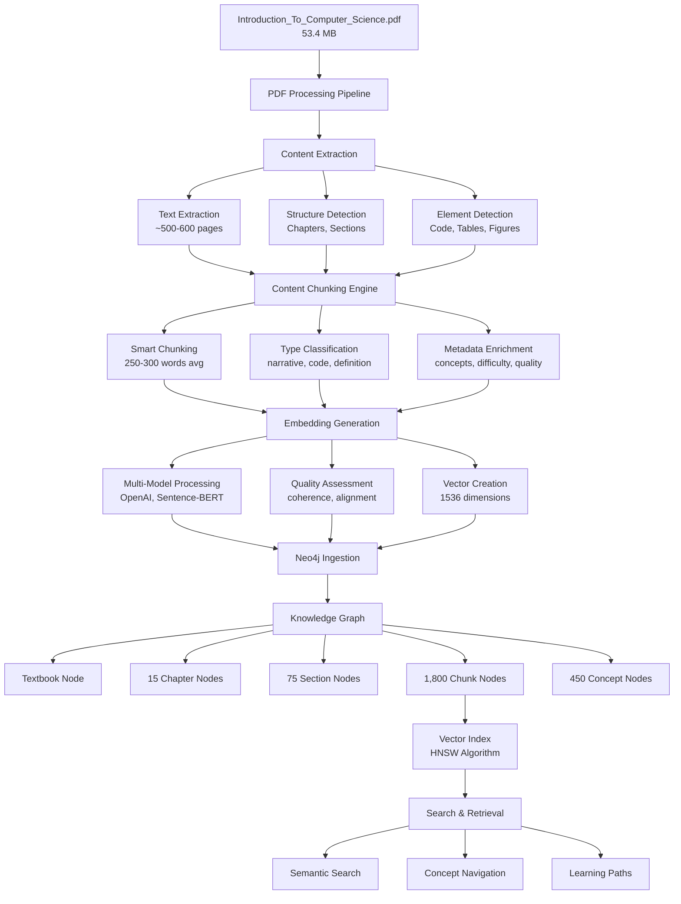

# PDF Processing Flow Visualization

## Complete Processing Pipeline



## Chunking Strategy Visualization

```
Original Section: "3.1 Introduction to Algorithms" (2000 words)
                           |
                           v
    +------------------+-------------------+------------------+
    |                  |                   |                  |
    v                  v                   v                  v
Chunk 1            Chunk 2             Chunk 3            Chunk 4
(Definition)       (Explanation)       (Example)         (Exercise)
250 words          300 words          200 words         250 words

Metadata:          Metadata:          Metadata:         Metadata:
- Type: def        - Type: narrative  - Type: code      - Type: exercise
- Concepts: [      - Concepts: [      - Concepts: [     - Concepts: [
  "algorithm",       "efficiency",      "sorting",        "algorithm",
  "computation"]     "complexity"]      "loop"]           "practice"]
- Difficulty: 0.3  - Difficulty: 0.5  - Difficulty: 0.6 - Difficulty: 0.7
```

## Embedding Space Visualization

```
                    Embedding Space (1536D → 2D projection)
    
    1.0 |  . . . . . . . . . . . . . . . . . . . . . . . . . .
        |  . . . . . . . . [Advanced Algorithms] . . . . . . .
        |  . . . . . . [Sorting] . . [Trees] . . . . . . . . .
    0.5 |  . . . . [Data Structures] . . . . . . . . . . . . .
        |  . . [Arrays] . . . . . [Graphs] . . . . . . . . . .
        |  . [Basics] . . . . . . . . . . . . . . . . . . . . .
    0.0 |  [Introduction] . . . . . [Programming] . . . . . . .
        |  . . . . . . . . . . . . . . . . . . . . . . . . . .
   -0.5 |  . . . . . . . . . . . . . . . . . . . . . . . . . .
        +-----------------------------------------------------
       -1.0                    0.0                         1.0

    Legend: [●] = Chunk embedding, proximity = semantic similarity
```

## Neo4j Graph Structure

```
                        (:Textbook)
                    "Intro to Computer Science"
                             |
                    HAS_CHAPTER (1:N)
                             |
                        (:Chapter)
                      "Algorithms"
                             |
                     HAS_SECTION (1:N)
                             |
                        (:Section)
                  "Sorting Algorithms"
                             |
                      HAS_CHUNK (1:N)
                             |
        +----------------+---+---+----------------+
        |                |       |                |
    (:Chunk)         (:Chunk)  (:Chunk)      (:Chunk)
  "Bubble Sort"    "Quick Sort" "Merge Sort"  "Comparison"
        |                |       |                |
        +----------------+---+---+----------------+
                             |
                    MENTIONS_CONCEPT (N:N)
                             |
                        (:Concept)
                     "Sorting Algorithm"
                             |
                     PREREQUISITE_OF
                             |
                        (:Concept)
                    "Advanced Sorting"
```

## Vector Search Process

```
User Query: "explain binary search algorithm"
                    |
                    v
            [Query Embedding]
              Vector: [0.021, -0.015, 0.038, ...]
                    |
                    v
            HNSW Index Search
            (k=10 nearest neighbors)
                    |
                    v
    +---------------+---------------+---------------+
    |               |               |               |
Chunk 427       Chunk 891       Chunk 243       Chunk 655
Score: 0.94     Score: 0.91     Score: 0.89     Score: 0.87
"Binary search  "Searching in   "Algorithm      "Search
 is a divide    sorted arrays"  complexity"      examples"
 and conquer"
    |
    v
Boost & Filter:
- Concept match: +0.1 if contains "binary search"
- Quality filter: score > 0.7
- Difficulty check: appropriate for user level
    |
    v
Final Ranking with Explanations
```

## Educational Metadata Flow

```
Raw Text: "A binary search algorithm finds the position of a target value..."
                            |
                            v
                    Chunk Processing
                            |
    +-----------+-----------+-----------+-----------+
    |           |           |           |           |
Key Concepts  Difficulty  Educational  Quality    Prerequisites
Extraction    Assessment  Elements     Scoring    Detection
    |           |           |           |           |
["binary      0.6         ["example",  0.88      ["arrays",
 search",     (medium)     "code",                "sorted data"]
 "algorithm"]              "explanation"]
                            |
                            v
                    Rich Metadata Bundle
                            |
                            v
                Stored with Chunk in Neo4j
```

## Learning Path Generation

```
User Profile: Beginner, knows basic programming
Target: "Master sorting algorithms"

                    Path Generation
                         |
                         v
    1. Prerequisites Check → ["arrays", "loops", "functions"]
                         |
                         v
    2. Concept Graph Traversal
       Start: "Introduction to Algorithms"
       Goal: "Advanced Sorting Algorithms"
                         |
                         v
    3. Optimal Path Selection
       [Intro] → [Arrays] → [Simple Sort] → [Efficient Sort] → [Advanced]
                         |
                         v
    4. Chunk Selection (best chunk per concept)
       - Intro: chunk_023 (difficulty: 0.2)
       - Arrays: chunk_156 (difficulty: 0.3)
       - Bubble Sort: chunk_427 (difficulty: 0.5)
       - Quick Sort: chunk_891 (difficulty: 0.7)
       - Advanced: chunk_1205 (difficulty: 0.9)
                         |
                         v
    5. Time Estimation: 6.5 hours total
```

This visualization shows how the Introduction to Computer Science PDF is transformed from a static document into an intelligent, searchable, and personalized learning resource through our sophisticated processing pipeline.