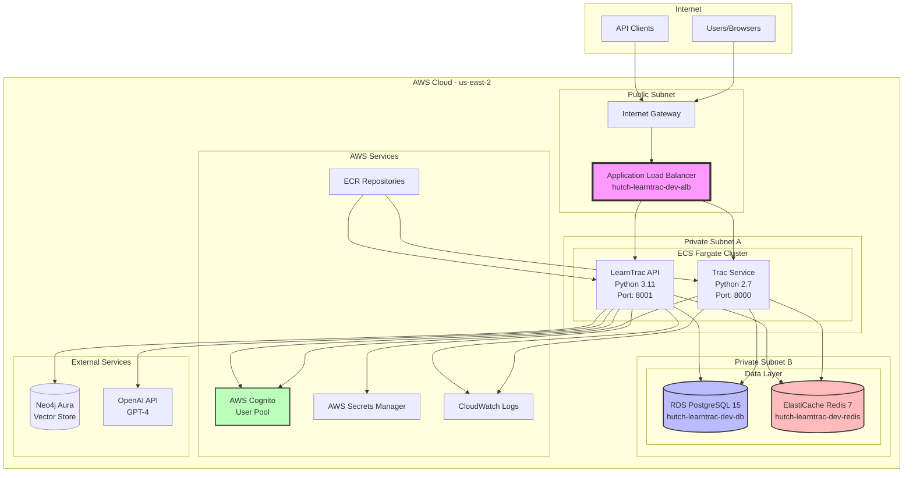
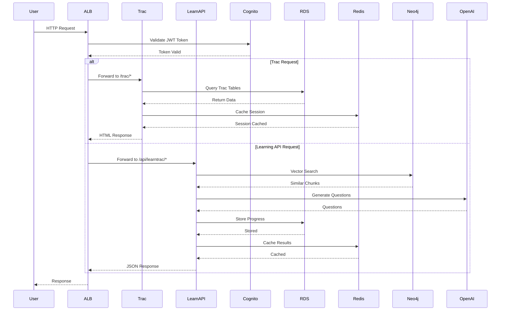
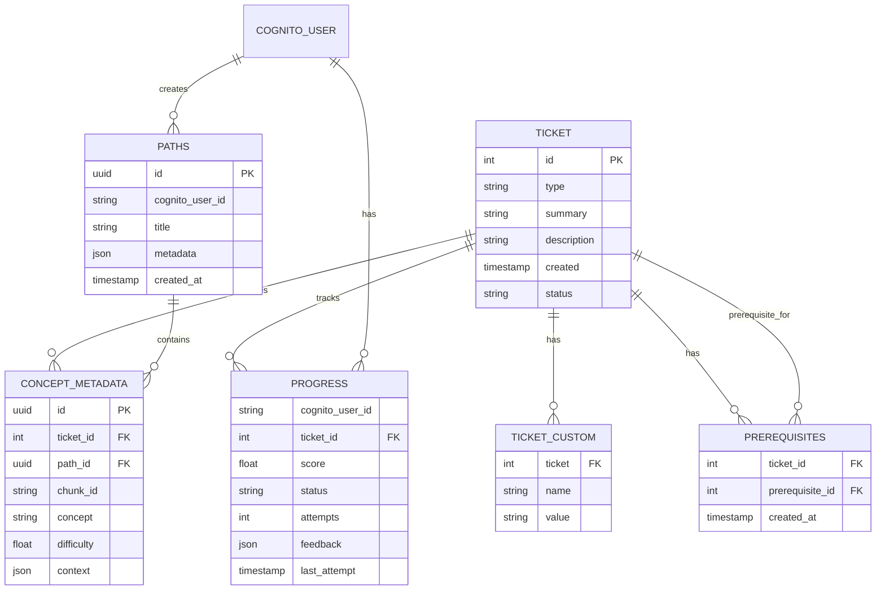
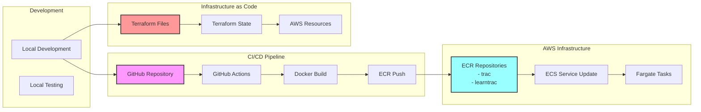
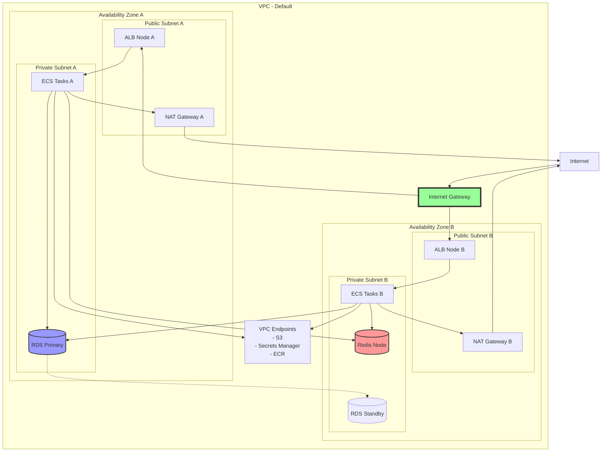
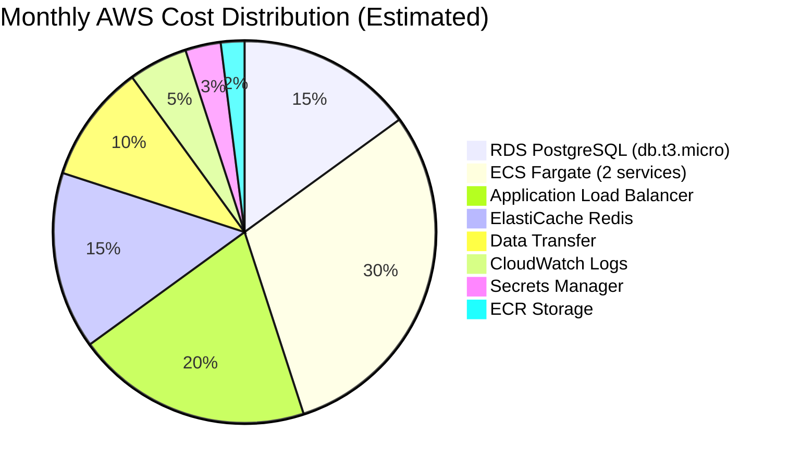
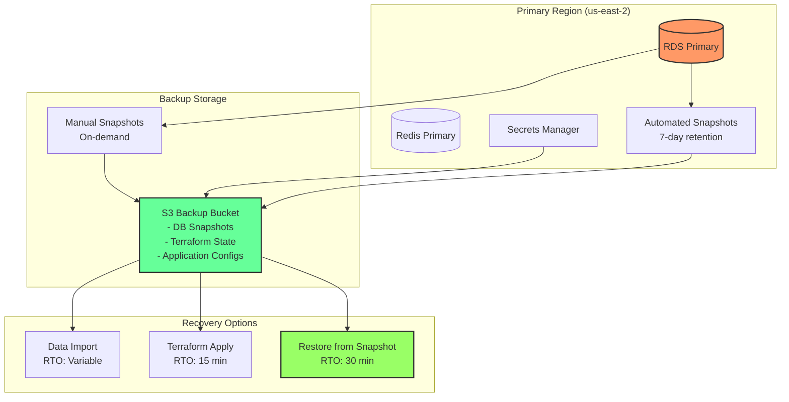

# LearnTrac Architecture Diagrams

## High-Level System Architecture



## Data Flow Architecture



## Database Schema Architecture



## Security Architecture

```mermaid
graph TB
    subgraph "Security Layers"
        subgraph "Edge Security"
            WAF[WAF Rules<br/>Optional]
            CloudFront[CloudFront CDN<br/>Optional]
        end
        
        subgraph "Application Security"
            ALB_SG[ALB Security Group<br/>Inbound: 80, 443<br/>Outbound: 8000, 8001]
            ECS_SG[ECS Task Security Group<br/>Inbound: 8000, 8001 from ALB<br/>Outbound: 5432, 6379, 443]
        end
        
        subgraph "Data Security"
            RDS_SG[RDS Security Group<br/>Inbound: 5432 from ECS<br/>Inbound: 5432 from 162.206.172.65]
            Redis_SG[Redis Security Group<br/>Inbound: 6379 from ECS]
        end
        
        subgraph "Identity & Access"
            IAM_Roles[IAM Roles<br/>ECS Task Execution<br/>ECS Task Role]
            Cognito_Auth[Cognito Auth<br/>JWT Tokens<br/>User Groups]
        end
        
        subgraph "Encryption"
            TLS[TLS in Transit<br/>HTTPS/SSL]
            Encryption[Encryption at Rest<br/>RDS Encrypted<br/>Secrets Encrypted]
        end
    end
    
    Internet --> WAF
    WAF --> CloudFront
    CloudFront --> ALB_SG
    ALB_SG --> ECS_SG
    ECS_SG --> RDS_SG
    ECS_SG --> Redis_SG
    
    IAM_Roles --> ECS_SG
    Cognito_Auth --> ALB_SG
    
    TLS -.-> ALB_SG
    TLS -.-> ECS_SG
    Encryption -.-> RDS_SG
    
    style ALB_SG fill:#f96,stroke:#333,stroke-width:2px
    style RDS_SG fill:#69f,stroke:#333,stroke-width:2px
    style Cognito_Auth fill:#6f9,stroke:#333,stroke-width:2px
```

## Deployment Architecture



## Network Flow Diagram



## Cost Optimization View



## Disaster Recovery Architecture



---

These diagrams provide a comprehensive view of the LearnTrac infrastructure architecture. They can be rendered using any Mermaid-compatible viewer or documentation tool.