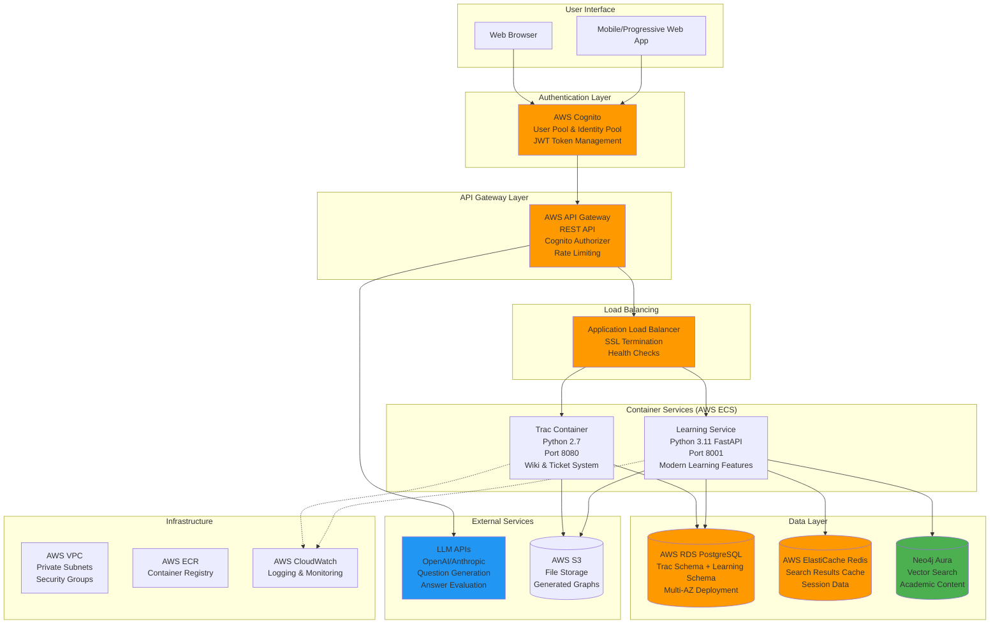
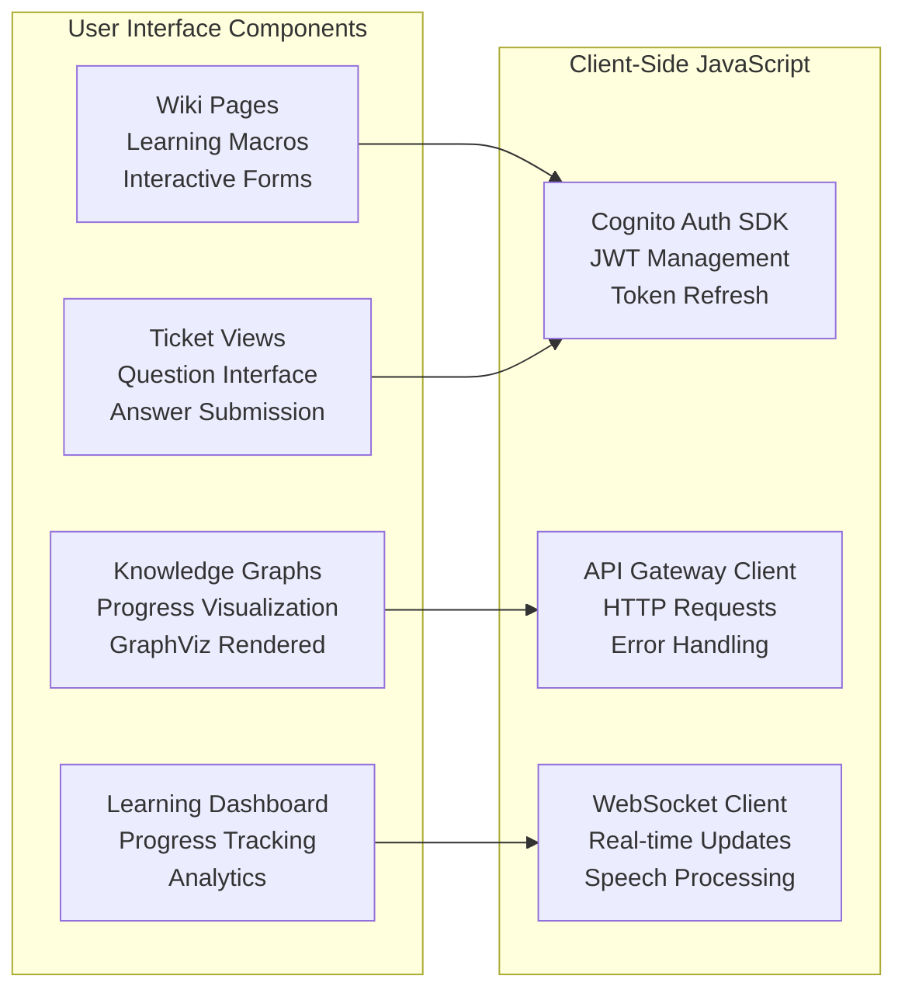
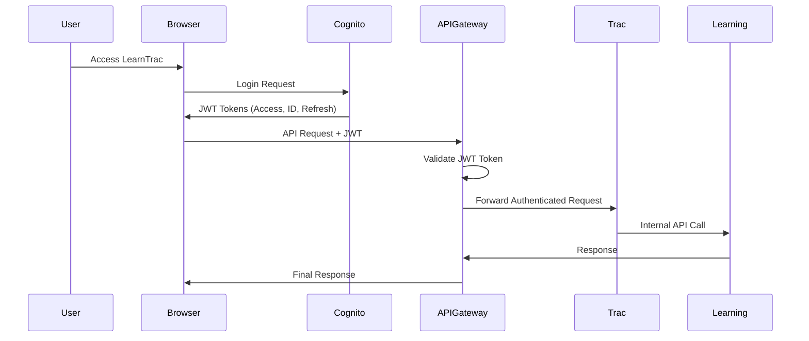
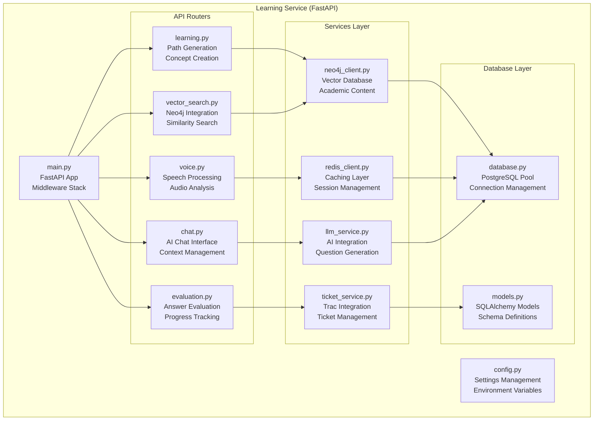
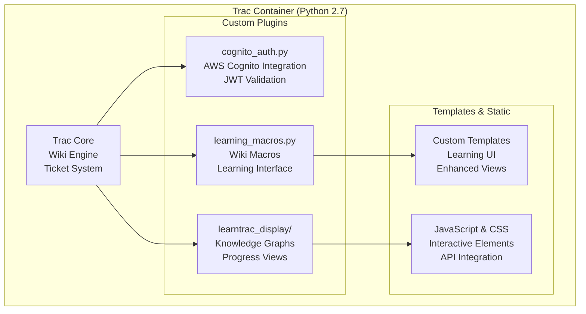
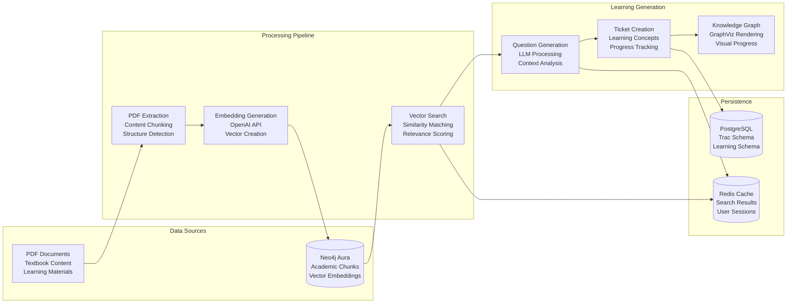
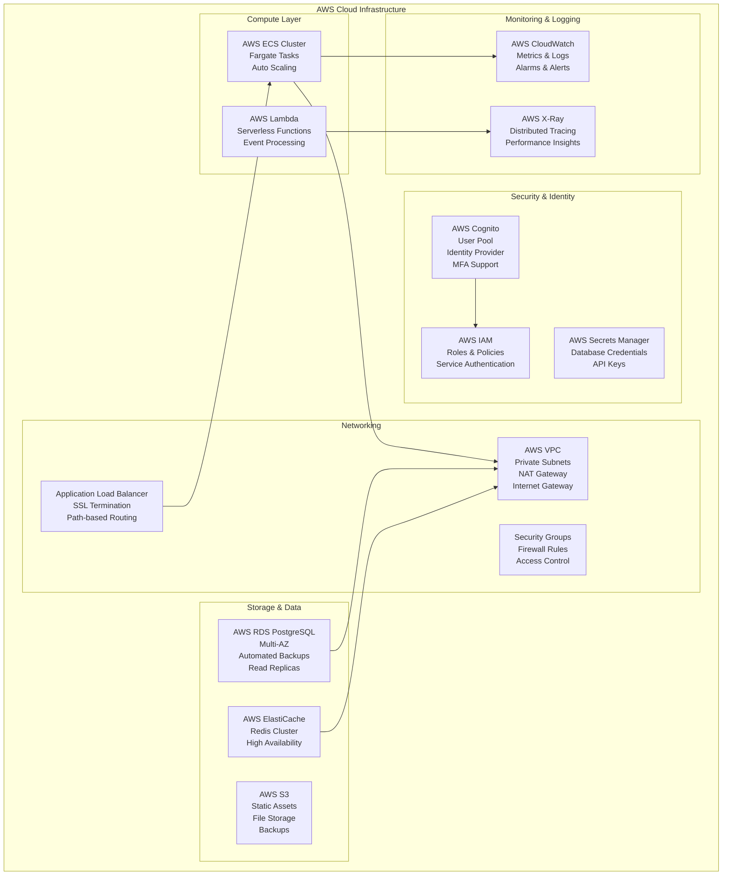
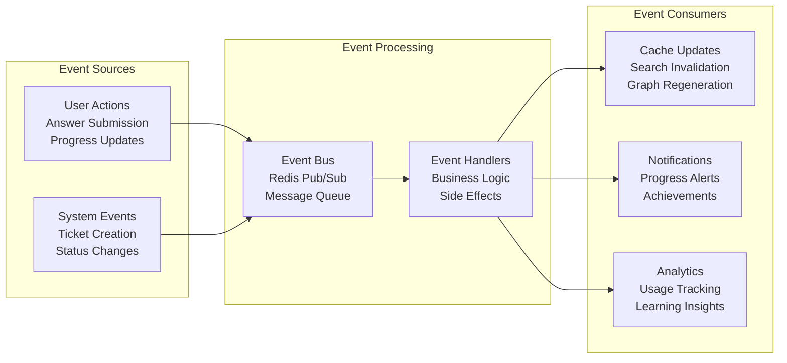
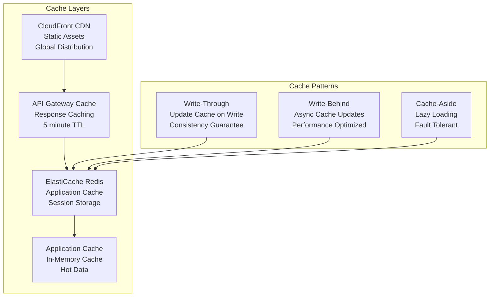

# LearnTrac System Architecture Diagram

## High-Level System Architecture

## Detailed Component Architecture

### 1. Frontend & User Interface Layer

### 2. Authentication & Security Flow

### 3. Learning Service Microservice Architecture

### 4. Trac Legacy System Integration

### 5. Data Flow Architecture

### 6. AWS Infrastructure Deployment

## System Integration Patterns

### 1. Event-Driven Architecture

### 2. Caching Strategy

## Technology Stack Summary

| Layer | Technology | Purpose |
|-------|------------|---------|
| **Frontend** | HTML5, JavaScript, CSS3 | User Interface |
| **Authentication** | AWS Cognito, JWT | User Management |
| **API Gateway** | AWS API Gateway | Request Routing |
| **Load Balancer** | AWS ALB | Traffic Distribution |
| **Legacy System** | Trac 1.4.4, Python 2.7 | Wiki & Tickets |
| **Modern API** | FastAPI, Python 3.11 | Learning Features |
| **Vector Database** | Neo4j Aura | Content Search |
| **Primary Database** | AWS RDS PostgreSQL | Data Persistence |
| **Cache** | AWS ElastiCache Redis | Performance |
| **Container Platform** | AWS ECS Fargate | Orchestration |
| **AI/ML** | OpenAI GPT-4, Anthropic Claude | Content Generation |
| **Monitoring** | AWS CloudWatch, X-Ray | Observability |
| **Storage** | AWS S3 | File Storage |

## Security Architecture

```mermaid
graph TB
    subgraph "Security Layers"
        WAF[AWS WAF<br/>Web Application Firewall<br/>DDoS Protection]
        COGNITO_AUTH[AWS Cognito<br/>Multi-Factor Authentication<br/>Social Login Integration]
        API_AUTH[API Gateway Authorizer<br/>JWT Validation<br/>Rate Limiting]
        VPC_SEC[VPC Security<br/>Private Subnets<br/>Security Groups<br/>NACLs]
        ENCRYPTION[Encryption<br/>TLS in Transit<br/>AES-256 at Rest]
    end
    
    subgraph "Security Controls"
        IAM_ROLES[IAM Roles<br/>Least Privilege<br/>Service-to-Service Auth]
        SECRETS_MGR[Secrets Manager<br/>Credential Rotation<br/>Secure Storage]
        AUDIT_LOG[Audit Logging<br/>CloudTrail<br/>Access Monitoring]
    end
    
    WAF --> COGNITO_AUTH
    COGNITO_AUTH --> API_AUTH
    API_AUTH --> VPC_SEC
    VPC_SEC --> ENCRYPTION
    
    IAM_ROLES --> SECRETS_MGR
    SECRETS_MGR --> AUDIT_LOG
```

This comprehensive system architecture diagram illustrates the LearnTrac learning management system built on AWS infrastructure, integrating legacy Trac capabilities with modern learning features through a cloud-native, microservices approach.